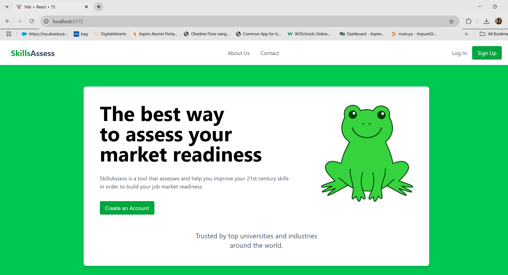
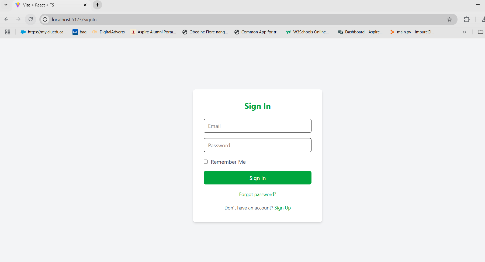
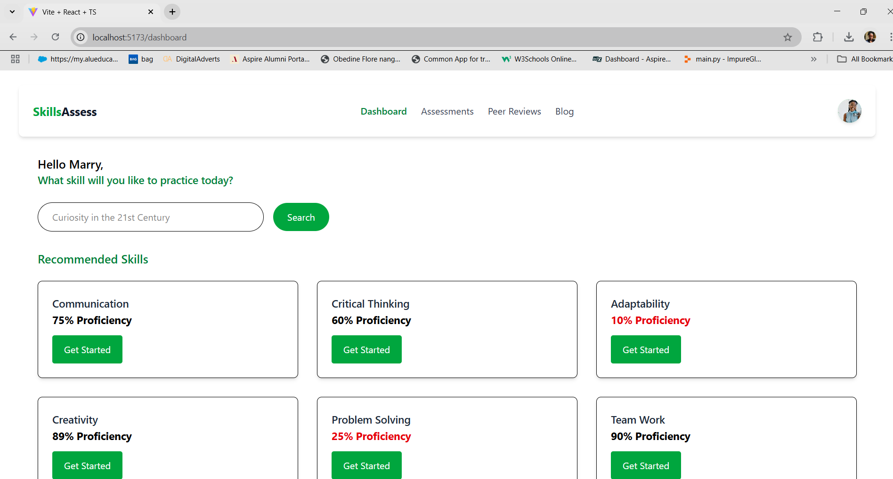
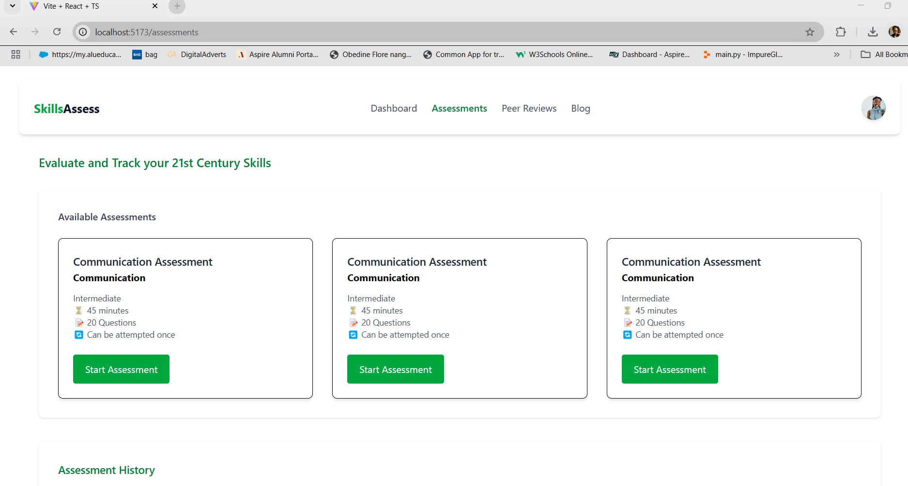
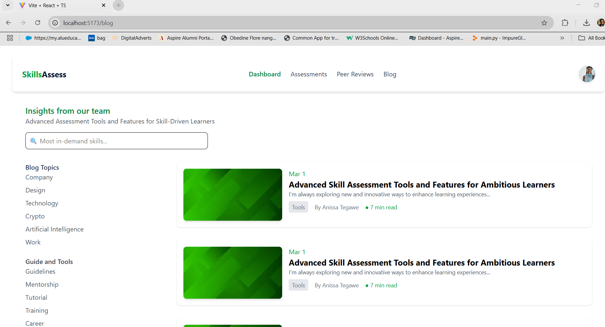
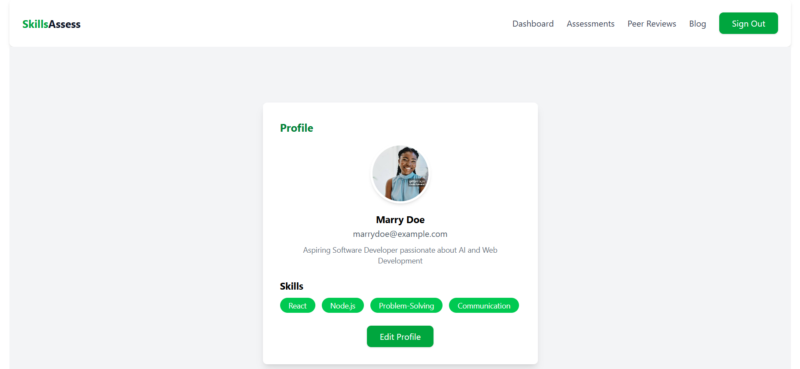
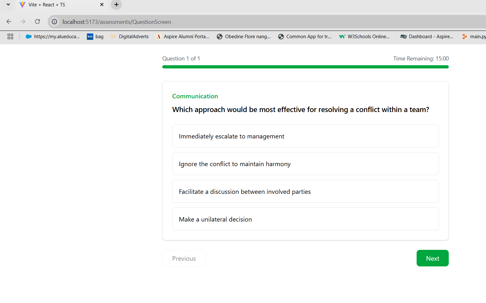
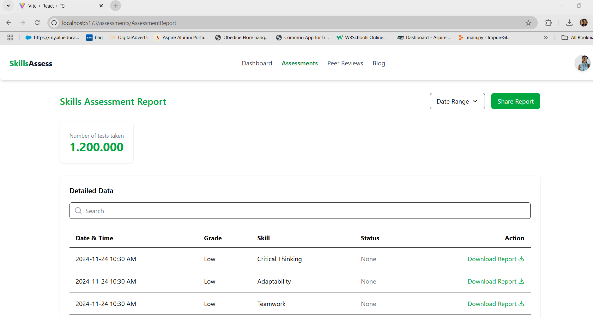
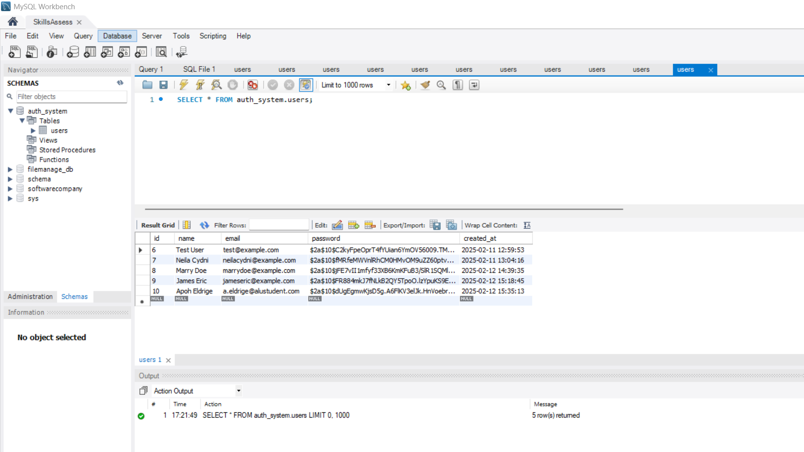

# Skill Development Self-Assessment Platform

## Description

The Skill Development Self-Assessment Platform is a web-based application designed to help individuals evaluate their skills, identify gaps, and receive recommendations for improvement. Users can take assessments, receive detailed reports, and track their progress over time. The platform features an intuitive UI built with React and Tailwind CSS, a backend powered by Node.js and MySQL, and secure authentication.

## GitHub Repository

https://github.com/Obedine-Flore/Capstone-Project.git

## Setup Instructions

### Prerequisites

Ensure you have the following installed on your system:

* Node.js (Latest LTS version recommended)

* MySQL

* Git

### Clone the Repository

`git clone [https://github.com/Obedine-Flore/Capstone-Project.git]`
`cd skill-assessment-platform`

### Backend Setup

1. Navigate to the backend directory:

`cd skills-assess-backend`

2. Install dependencies:

`npm install`

3. Configure environment variables:

* Create a .env file in the backend directory and set up the following variables:

PORT=5000
DB_HOST=localhost
DB_USER=root
DB_PASSWORD=password
DB_NAME=SkillsAssess

4. Initialize the database:

Run MySQL and create the database manually:

`CREATE DATABASE skill_assessment_db`;

5. Start the backend server:

`npm start`

### Frontend Setup

1. Navigate to the frontend directory:

`cd skills-assessment-platform`

2. Install dependencies:

`npm install`

3. Start the development server:

`npm run dev`

## Designs
### Figma Mockup

Link:https://www.figma.com/design/kop3vnP1GSGure8CmyM3TV/SkillsAssess?node-id=0-1&t=qpz0jFdTdZXFKTpW-1

## App Interface

## Deployment Plan
### Backend Deployment
The Node.js backend will be deployed using the Heroku cloud platform.

A MySQL database will be set up on Amazon RDS, DigitalOcean Managed Databases, or another cloud provider.

PM2 will be configured to keep the backend running efficiently.

Nginx will be used as a reverse proxy to manage API requests.

### Frontend Deployment
The React application will be deployed using Netlify.

Proper configuration will ensure that the frontend communicates seamlessly with the deployed backend via the correct API endpoints.

### Database Deployment
The database will be deployed using Amazon RDS, DigitalOcean Managed Databases, or a self-hosted MySQL instance.

Security measures, including authentication and access control, will be implemented to protect the database.

Database backups and monitoring tools will be set up to ensure reliability and data integrity.

### Environment Variables
Sensitive information will be securely stored using dotenv files (.env), AWS Secrets Manager, or environment variables on the cloud platform.

### Continuous Deployment (CI/CD)
GitHub Actions, Jenkins, or Travis CI will be used to automate deployments.

Automatic deployments will be set up to trigger on push to the main branch or a designated deployment branch.

## Video Demo

https://drive.google.com/file/d/1tF8Z5SVkptgX4GGKRcnFkx1-khx4GRFn/view?usp=sharing
